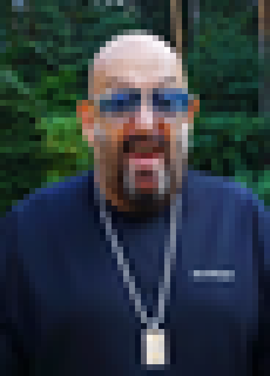

# sep3 — «И снова третье сентября»

Every September 3rd, Mikhail Shufutinsky's «Третье сентября» becomes a nationwide meme:
*«я календарь переверну…»*. So here is a Google Sheet that **can only ever be September 3rd**.

It's a **public, anyone-can-edit** spreadsheet whose desired state is a gold banner
«И СНОВА ТРЕТЬЕ СЕНТЯБРЯ» and a pixel portrait of Shufutinsky drawn in **cell backgrounds**.
A [SheetsOperator](https://github.com/sncfoundation/sheets-operator) controller reconciles it every
few seconds — edit anything, recolor cells, delete his face, and it snaps right back. You cannot win.
You will календарь переверну, and it will переверну back.



## Live

- **Managed sheet (public — go vandalize it):** https://docs.google.com/spreadsheets/d/1AEF9J07u4GV66Hs5zURpWQwN9tFuFwNr3-rVdeoaCMQ/edit
- **Control plane (read-only registry):** https://docs.google.com/spreadsheets/d/1ihtshuJoTZ0muxKUjiCe_3HYlaAGpODDNb60-Mu3AmU/edit

(Live only while a controller is running against it.)

## Run it yourself

This is a template for [`sheets-operator`](https://github.com/sncfoundation/sheets-operator).

```bash
git clone https://github.com/sncfoundation/sheets-operator && cd sheets-operator
git clone https://github.com/sncfoundation/demos                     # templates live here
cp /path/to/google-oauth-authorized-user.json creds.json

# create your own self-healing "3 сентября" sheet from this template:
SHEETSOP_TEMPLATES=demos/sep3 SHEETSOP_CREDS=creds.json \
  python3 sheetsctl.py apply my-sep3 --template sep3

# then run the controller so it self-heals (point it at the sep3 template):
docker run -d --restart unless-stopped \
  -e SHEETSOP_CONTROL=<your-control-plane-id> -e SHEETSOP_TEMPLATES=/templates -e PYTHONUNBUFFERED=1 \
  -v $PWD/creds.json:/creds/creds.json:ro -v $PWD/demos/sep3:/templates:ro \
  sheets-operator:1 run --interval 10
```

## What self-heals, and the one thing that needs a janitor

The external controller reconciles everything the Sheets API exposes: cell **values**,
**backgrounds**, **notes**, and embedded **charts**. Delete the face, recolor cells, paste a
formula or an `=IMAGE()` in a cell, drop a chart — all reverted.

The exception is a **floating image inserted over the cells** (Insert → Image → "Image over
cells") or a **Drawing**. Sheets API v4 does not expose those objects at all, so no external
controller can remove them. The only tool that can is Apps Script bound to the sheet. If you
want the demo bulletproof against that too, add [`janitor.gs`](janitor.gs) to the managed
sheet with a one-minute trigger — a dumb actuator that just removes over-cell images. The
controller stays the operator; the janitor covers the one object class Google withholds from
the API.

## How the face was made

`build_face.py` downloads the freely-licensed [Wikimedia photo](https://commons.wikimedia.org/wiki/File:%D0%9C%D0%B8%D1%85%D0%B0%D0%B8%D0%BB_%D0%A8%D1%83%D1%84%D1%83%D1%82%D0%B8%D0%BD%D1%81%D0%BA%D0%B8%D0%B9_(03-09-2021)_(cropped).png)
(taken, fittingly, on **03-09-2021**) and downsamples it to a 46-wide cell grid. Re-run it to
regenerate `sep3.json`:

```bash
python3 build_face.py     # needs ImageMagick
```

<sub>Photo: Wikimedia Commons, CC BY-SA. This is a parody/meme demo.</sub>
